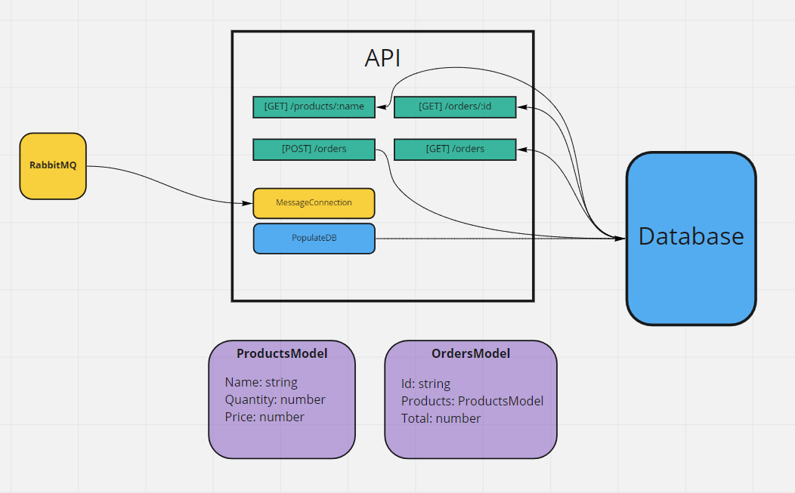

# Desafio DeliveryMuch

Projeto realizado como desafio para vaga de Backend Developer.

## Dependencias

- RabbitMQ 
- MongoDB
## Rodando o projeto

### Para rodar o projeto sem o uso do docker
- configurar as variaveis de ambiend em um arquivo .env, seguindo o .env.example
- executar npm start

### Executando com o docker
- iniciar o container com RabbitMQ e o serviço produtor de menssagens dentro da pasta /outsource
- iniciar o container na pasta raiz com docker-compose up -d

depois de iniciar o mongodb e antes de rodar o projeto, para popular o banco com o csv:

```
$ node populate.js
```

Modelo base:
